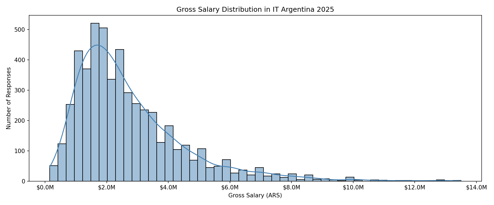
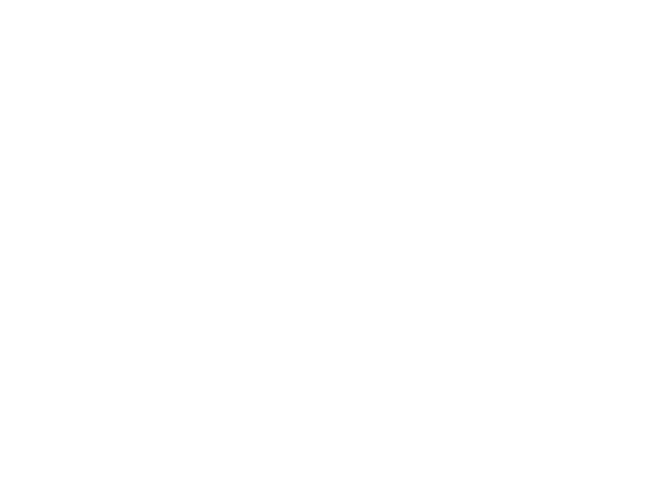
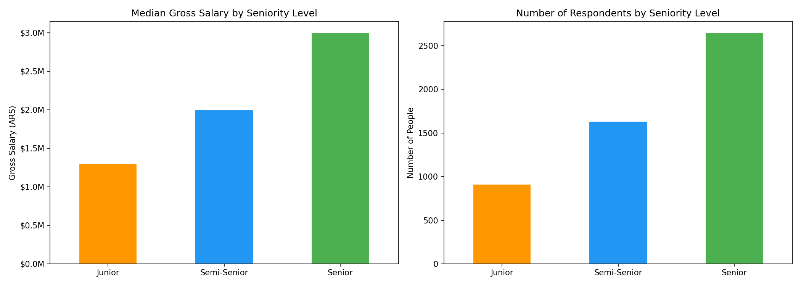
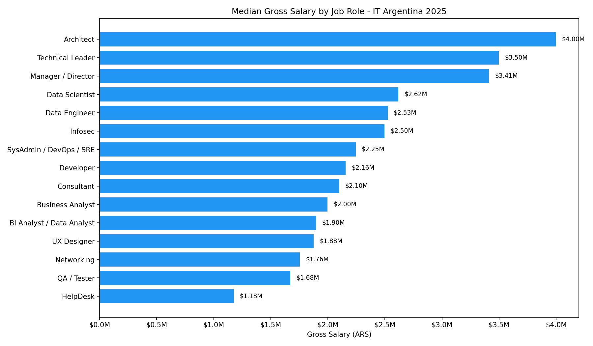

# 🇦🇷 IT Salary Analysis — Argentina 2025

Exploratory data analysis of IT salaries in Argentina, based on the **sysarmy salary survey (2025.1)** with over 5,000 responses from professionals across the tech industry.

The goal of this project is to uncover patterns in compensation across different job roles, seniority levels, and work modalities using Python and data visualization tools.

---

## 📊 Key Findings

### Gross Salary Distribution
Most IT salaries in Argentina fall between **$1M and $3M ARS**, with a median of ~$2.3M. The distribution shows a positive skew, with a small number of professionals earning above $8M.



---

### Salary by Work Modality
Remote and hybrid workers earn significantly more than on-site workers. **100% remote** and **hybrid** roles share a median salary of ~$2.3M ARS, while **100% on-site** roles average ~$1.5M — roughly 35% less.



---

### Salary by Seniority Level
There is a clear and consistent salary progression across seniority levels:
- **Junior**: ~$1.3M ARS
- **Semi-Senior**: ~$2.0M ARS (+54%)
- **Senior**: ~$3.0M ARS (+50%)



---

### Salary by Job Role
Architects, Technical Leaders, and Managers top the pay scale (~$3.5M–$4M ARS), while HelpDesk and QA roles sit at the lower end. Data-focused roles (Data Scientist, Data Engineer) are well above average.



---

## 🛠️ Tech Stack

- **Python 3**
- **Pandas** — data manipulation
- **Matplotlib & Seaborn** — data visualization
- **SQLite** — data storage
- **Jupyter Notebook** — analysis environment
- **VS Code**

---

## 📁 Project Structure

```
it-salary-analysis/
├── data/               # Raw dataset (CSV)
├── notebooks/          # Jupyter notebooks
│   └── 01_exploratory_analysis.ipynb
├── images/             # Generated charts
└── README.md
```

---

## 📌 Data Source

[sysarmy Salary Survey 2025.1](https://sysarmy.com/blog/posts/resultados-de-la-encuesta-de-sueldos-2025-1/) — open dataset published under a Creative Commons Attribution-NonCommercial-ShareAlike 4.0 license.

---

---

# 🇦🇷 Análisis de Sueldos IT — Argentina 2025

Análisis exploratorio de sueldos en el sector IT de Argentina, basado en la **encuesta de sueldos de sysarmy (2025.1)** con más de 5.000 respuestas de profesionales del sector tecnológico.

El objetivo del proyecto es identificar patrones en la remuneración según rol, nivel de seniority y modalidad de trabajo, usando Python y herramientas de visualización de datos.

---

## 📊 Principales hallazgos

### Distribución de salarios brutos
La mayoría de los sueldos IT en Argentina se concentran entre **$1M y $3M ARS**, con una mediana de ~$2.3M. La distribución muestra una asimetría positiva, con una minoría de profesionales ganando más de $8M.


---

### Salario por modalidad de trabajo
Los trabajadores remotos e híbridos ganan significativamente más que los presenciales. El trabajo **100% remoto** e **híbrido** comparten una mediana de ~$2.3M ARS, mientras que el trabajo **100% presencial** promedia ~$1.5M — aproximadamente un 35% menos.


---

### Salario por nivel de seniority
Existe una progresión salarial clara y consistente:
- **Junior**: ~$1.3M ARS
- **Semi-Senior**: ~$2.0M ARS (+54%)
- **Senior**: ~$3.0M ARS (+50%)


---

### Salario por rol
Los Architects, Technical Leaders y Managers lideran la escala salarial (~$3.5M–$4M ARS), mientras que HelpDesk y QA se ubican en el extremo inferior. Los roles orientados a datos (Data Scientist, Data Engineer) están bien por encima del promedio.


---

## 🛠️ Tecnologías utilizadas

- **Python 3**
- **Pandas** — manipulación de datos
- **Matplotlib & Seaborn** — visualización
- **SQLite** — almacenamiento de datos
- **Jupyter Notebook** — entorno de análisis
- **VS Code**

---

## 📁 Estructura del proyecto

```
it-salary-analysis/
├── data/               # Dataset original (CSV)
├── notebooks/          # Jupyter notebooks
│   └── 01_exploratory_analysis.ipynb
├── images/             # Gráficos generados
└── README.md
```

---

## 📌 Fuente de datos

[Encuesta de sueldos sysarmy 2025.1](https://sysarmy.com/blog/posts/resultados-de-la-encuesta-de-sueldos-2025-1/) — dataset abierto publicado bajo licencia Creative Commons Atribución-NoComercial-CompartirIgual 4.0.
